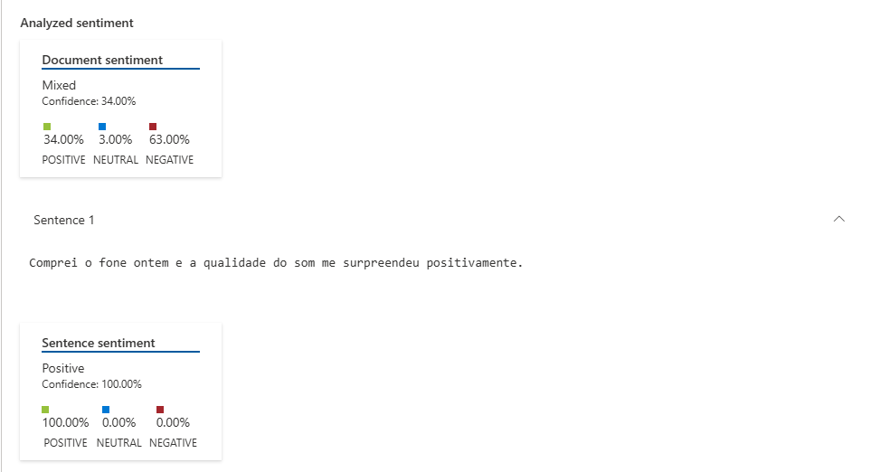
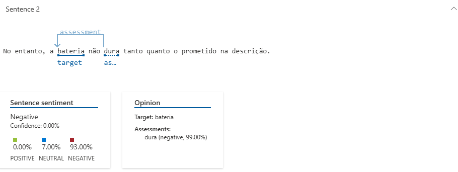
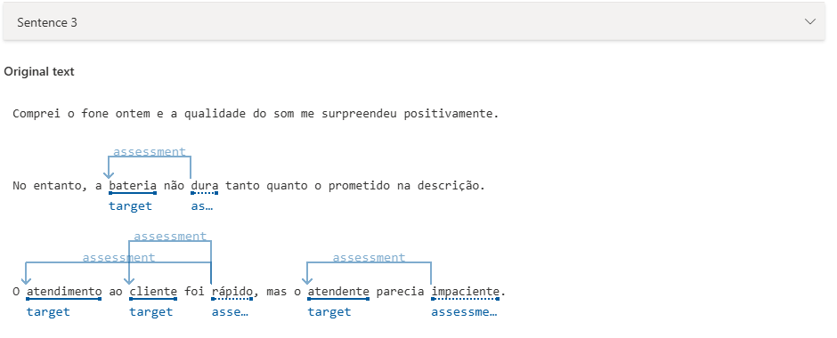

# 🧠 Intro Azure Language Studio

Este repositório oferece um passo a passo para começar a usar o **Azure AI Language Studio**, desde a criação do recurso no portal Azure até os testes iniciais com o serviço.

---

## ✅ Pré-requisitos

Antes de começar, verifique se você possui:

- Conta ativa no [Microsoft Azure](https://azure.microsoft.com/)
- Acesso ao [Azure AI Language Studio](https://language.cognitive.azure.com/)

---

## 🚀 Criando seu Projeto no Azure AI Language Studio

### 1️⃣ Criando o Recurso no Azure

1. Acesse o [Portal do Azure](https://portal.azure.com/)
2. Vá em **Criar um recurso**
3. Pesquise por **Azure AI Language** e selecione-o
4. Clique em **Criar** e preencha as informações:
   - **Grupo de Recursos**: novo ou existente  
   - **Nome do Recurso**: escolha um nome único  
   - **Região**: selecione a mais próxima  
   - **Plano de Tarifas**: use o gratuito para testes  
5. Clique em **Revisar e Criar** → **Criar**
6. Após a criação, copie a **Chave de Acesso** e o **Endpoint**

### 2️⃣ Configurando o Language Studio

1. Acesse o [Azure AI Language Studio](https://language.cognitive.azure.com/)
2. Faça login com sua conta Azure
3. Clique em **Criar um Projeto** e escolha o tipo de análise:
   - Ex: Análise de Sentimentos, Extração de Entidades, etc.
4. Insira a **Chave de Acesso** e o **Endpoint** do recurso criado

---

## 🧪 Realizando Testes

Você pode testar os recursos pela interface web do Language Studio ou via requisições API.

### 🌐 Imagens do teste via Interface Web

## 🔗 Links importantes
- [Explore Speech Studio](https://speech.microsoft.com/)
- [Analyze text with Language Studio](https://language.cognitive.azure.com/)
